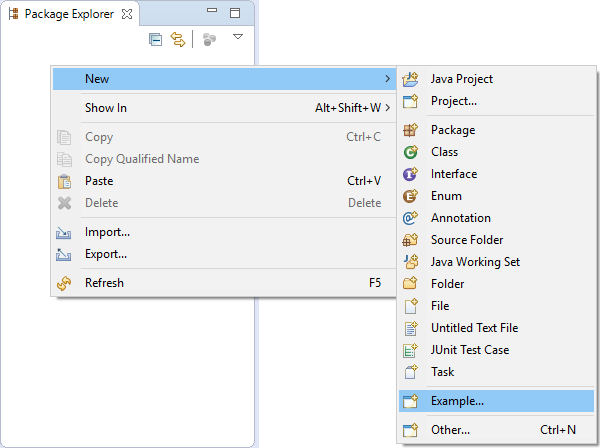
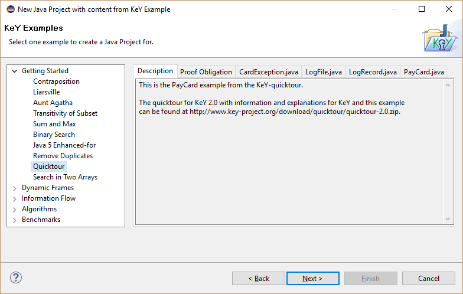
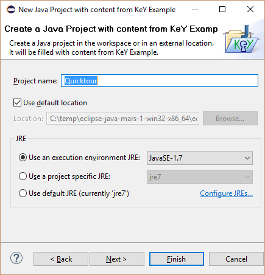
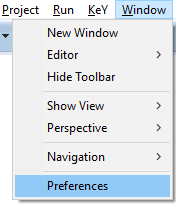
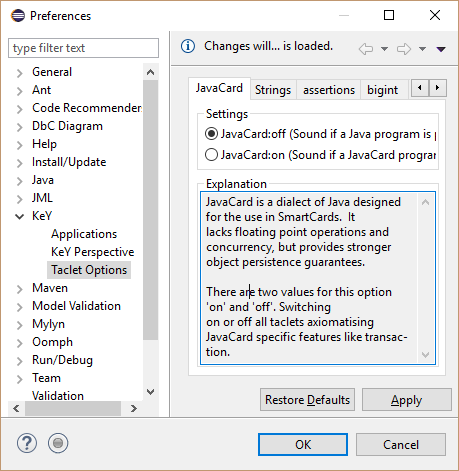
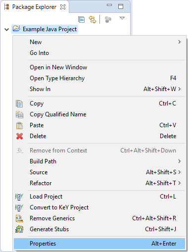
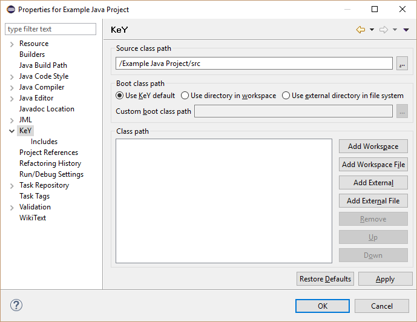
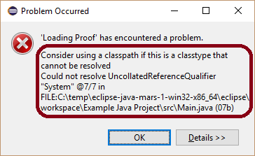

# KeY basics in Eclipse (Cross-project Functionality)

The following functionality is independent from a specific KeY-based Eclipse project.

The following sections illustrate features independent from a specific
KeY-based Eclipse project using screenshots. Each section contains
numbered screenshots that explain a usage scenario step by step.
Clicking on each picture produces a more detailed view. The
screenshots may differ from the latest release.


## Create an example project

1. Open example project wizard via Package Explorer context menu item "New, Example...".
   
    [](example01.png)

2. Select "KeY, KeY Example"

    [](example02.png) 

3. Select one of the provided examples.
 
    [](example03.png) 

4. Define a project name.

    [](example04.png)

5. Work with the created project. In the "Quicktour" example it is required to delete the package "gui".

    [](example05.png) 

### Change taclet options

1. Open preference dialog via main menu item "Window, Preferences".

    [](taclet01.png) 

2. Select preference page "KeY, Taclet Options" and change settings.
   The next instantiate proof will use them; current proofs are not
   influenced by changes.

    [](taclet02.png) 

## Define class path used by KeY

1. Open project properties of a Java/KeY project via context menu item "Properties".

    [](classPath01.png) 


2. Select properties page "KeY" and add additional source files. These
   files will be considered when the next proof is instantiated.
    [](classPath02.png) 
 
    * Boot class path: Replaces stubs and specifications provided by
     KeY, but also method implementations are considered.
    * Class path: Additional locations to the boot class path, only
     method stubs and specifications re considered

## Troubleshooting

The following subsections explain solutions for common problems using
KeY within Eclipse.

### Unresolved classtype (support for API classes)

**Problem:** An error containing "_Consider using a classpath if this
is a classtype that cannot be resolved_" or "_Could not resolve
UncollatedReferenceQualifier_" is shown. The following screenshot
shows such an error message which occurred when a proof for method
`magic()` (see listing of `Main`) was started.



```java
public class Main {
	/*@ normal_behavior
	  @ requires System.\inv;
	  @ ensures \result == 42;
	  @*/
	public static int magic() {
		System.out.println(42);
		return 42;
	}
}
```


**Reason:** Such an error message is shown whenever KeY was unable to
find a type in KeY's class paths specified in the [project
properties](#KeYsClassPath). KeY operates on source code and not on
compiled byte code. This requires to provide the source code of all
used types or at least stubs of called methods. Method stubs can be
specified with [JML](http://www.jmlspecs.org/). KeY itself provides
such stubs and specifications only for a minimal fraction of the Java
API.

**Solution:**

1.  Create a new folder, for instance named "lib_specs", within the
    project and ensure that the folder is not part of the regular Java
    class path used by JDT.
2.  Add the new folder to KeY's classpath (not boot class path) in the
    project properties as described in section [Define class path used
    by KeY](#KeYsClassPath).
3.  Populate the folder with files "System.java" and
    "PrintStream.java" with content from the listings below.

**Hint:** [Stubby](../Stubby/index.html) can generate stub files for
used API members automatically.


```java
package java.lang;

import java.io.PrintStream;

public class System {
   /*@ public static invariant \invariant_for(out);
     @*/
   public static final PrintStream out;
}
```

```java
package java.io;

public class PrintStream {
  /*@ public normal_behavior
    @ ensures true;
    @*/
  public void /*@ strictly_pure @*/ println(int x);
}
```
