# KeYIDE

KeYIDE is an alternative user interface for KeY directly integrated into
Eclipse. The goal of this project is to provide the same functionality
as the original user interface of KeY. Up to now only the basics (proof
tree navigation, auto mode, interactive rule application) are available.

The following sections illustrate the main features of the KeYIDE using
screenshots. Each section contains numbered screenshots that explain a
usage scenario step by step. Clicking on each picture produces a more
detailed view. The screenshots may differ from the latest release.

### Prerequisites

The KeYIDE is compatible with [Eclipse](http://www.eclipse.org) Indigo
(3.7) or newer.

Required update-sites and installation instructions are available in the
[download](https://www.key-project.org/download/) area.

### Verify a method contract

1. Select the method to verify.

    

2. Start proof via main menu item "KeY, Start
Proof".

    

3. Select Application
"KeYIDE".

    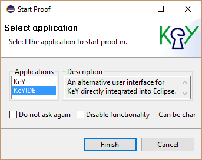

4. Select method contract to
prove.

    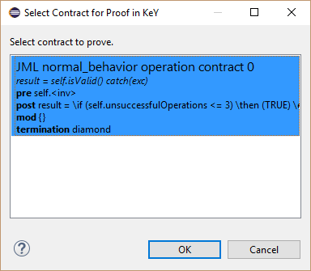

5. Switch to perspective
"KeY".

    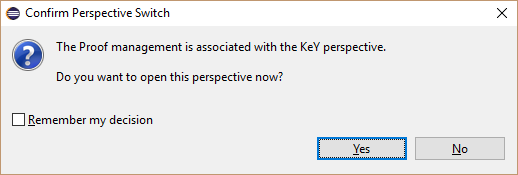

6. Do proof directly in
Eclipse.

    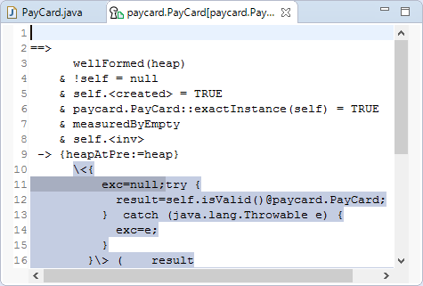

### Start auto mode

1. Change strategy settings if
required.

    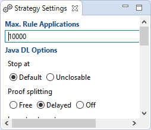

2. Start auto mode via editor specifc toolbar item "Start Auto Mode".

    

3. Wait while auto mode is active.

    

4. Inspect result.

    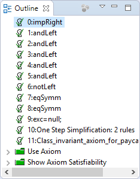

### Stop auto mode when breakpoint is hit

1. Define a Line, Method or Java Exception breakpoint, a Watchpoint or
a KeY Watchpoint as usual.

    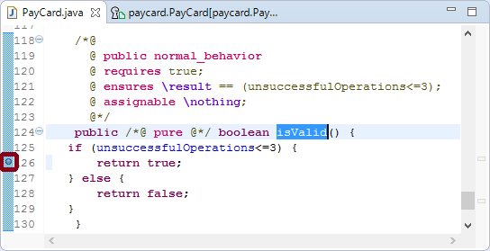

2. Select toolbar item "Stop at Breakpoints" before starting the auto
mode.

    

3. Auto mode stops when breakpoint is hit.

    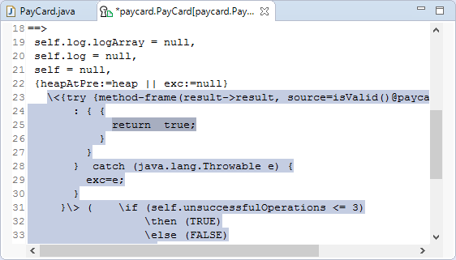

### Apply a rule interactively

1. Move the mouse over a term and apply a rule via the context
menu.

    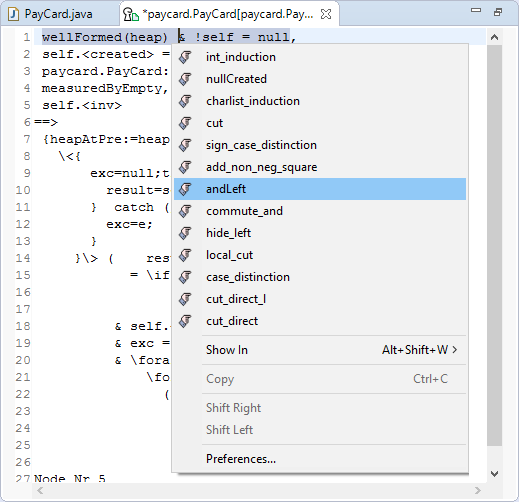

### Generate a counter example

1. Select context menu item "Counterexample" of a goal.

    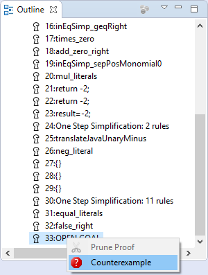

2. Optionally visualize counter example via context menu item
"Visualize Model".

    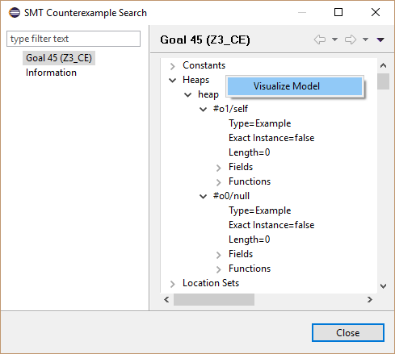

3. Inspect the visualized counter example.

    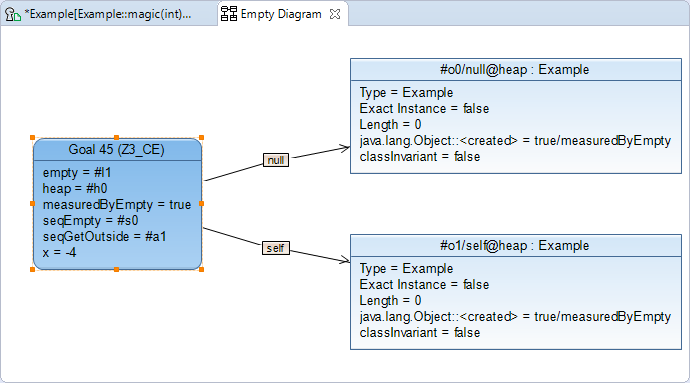

### Generate test cases

1. Select toolbar item "Generate test cases for open goals".

    

2. An additional Java project is created which contains the generated
test cases. Follow the instructions in the Reame.txt file to add
missing libraries.

    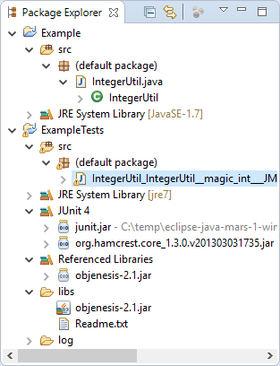

### KeY basics in Eclipse and troubleshooting

- [KeY basics in Eclipse (Cross-project Functionality)](../CrossProject/)
  - [Create an example project](../CrossProject/#create-an-example-project)
  - [Change taclet options](../CrossProject/#change-taclet-options)
  - [Define class path used by KeY](../CrossProject/#define-class-path-used-by-key)
- [Troubleshooting](../CrossProject/#troubleshooting)
  - [Unresolved classtype (support for API classes)](../CrossProject/#unresolved-classtype-support-for-api-classes)