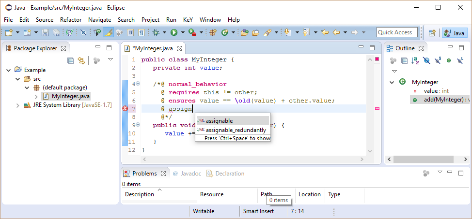
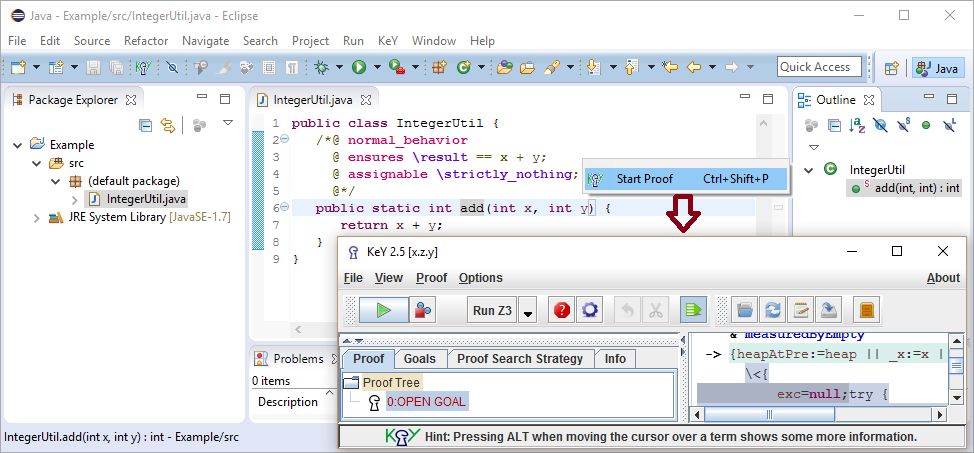
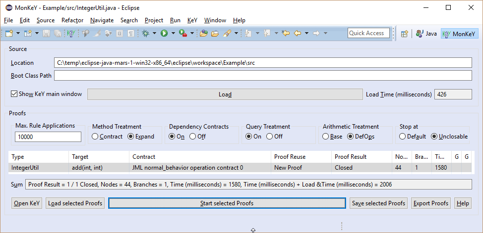
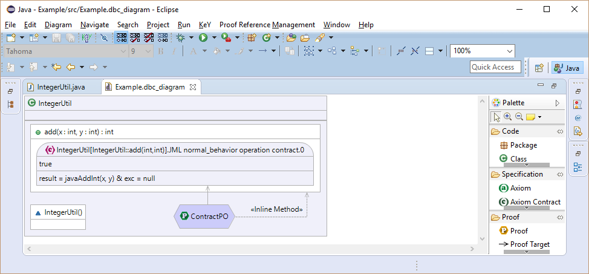
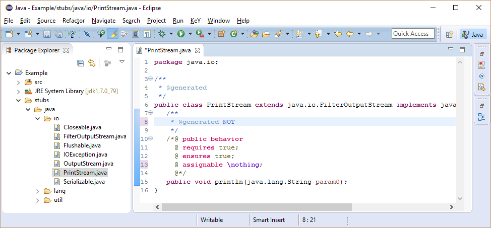

# KeYClipse

## Symbolic Execution Debugger (SED)

The Symbolic Execution Debugger (SED) is a debugger based on symbolic
execution which allows to discover all possible execution paths
simultaneously. This is achieved by the use of symbolic in lieu of
concrete values resulting in a symbolic execution tree. Each node in the
symbolic execution tree provides the full state and related information
such as the symbolic call stack or the path conditions under which the
node is reached.

The following screenshot gives an impression of how the tool looks like.
More details including download instructions and a user guide are
available on the [Symbolic Execution Debugger](SED/) website.

["){: style="width:100%"}](SED/)

## KeY Resources

KeY Resources provides the \"KeY project\" with automatic background
proofs. Such projects extends the functionality of a Java project by
maintaining automatically proofs in background. This means that the tool
tries to do proofs automatically whenever files in a project change.
Markers are used to show the proof result directly in the source editor.

The following screenshot gives an impression of how the tool looks like.
More details including download instructions and a user guide are
available on the [KeY Resources](KeYResources/) website.

[{: style="width:100%"}](KeYResources/)

## JML Editing

JML Editing extends the [Java development tools
(JDT)](https://eclipse.org/jdt/) with support for
[JML](http://www.jmlspecs.org) to make writing JML specifications as
convenient as writing Java source code.

The following screenshot gives an impression of how the tool looks like.
More details including download instructions are available on the [JML
Editing](JMLEditing/) website.

[{: style="width:100%"}](JMLEditing/)

## KeY 4 Eclipse Starter

KeY 4 Eclipse Starter is a basic Eclipse extension to start KeY from
within Eclipse.

The following screenshot gives an impression of how the tool looks like.
More details including download instructions and a user guide are
available on the [KeY 4 Eclipse Starter](Starter/) website.

[{: style="width:100%"}](Starter/)

## KeYIDE

KeYIDE is an alternative user interface for KeY directly integrated into
Eclipse. The goal of this project is to provide the same functionality
as the original user interface of KeY. Up to now only the basics (proof
tree navigation, auto mode, interactive rule application) are available.

The following screenshot gives an impression of how the tool looks like.
More details including download instructions and a user guide are
available on the [KeYIDE](KeYIDE/) website.

[{: style="width:100%"}](KeYIDE/)

## MonKeY {:#MonKeY}

MonKeY provides a batch verification of all proof obligations. This
means that the tool lists all proof obligations provided by the source
code and allows to prove them in a batch. Statistics such as the used
time or the complexity of proofs are also provided.

The following screenshot gives an impression of how the tool looks like.
More details including download instructions and a user guide are
available on the [MonKeY](MonKeY/) website.

[{: style="width:100%"}](MonKeY/)

## Visual DbC

Visual DbC is a proof management and visualization tool. It allows to
visualize code members (e.g. types, attributes, methods) together with
specifications (e.g. method contracts, invariants) and proofs in a DbC
diagram similar to an UML class diagram. Proof references are used to
indicate that a code member or a specification is used by a proof.

The following screenshot gives an impression of how the tool looks like.
More details including download instructions and a user guide are
available on the [VisualDbC](VisualDbC/) website.

[{: style="width:100%"}](VisualDbC/)

## Stubby - The Stub Generator

Stubby allows to generate stubs annotated with default JML
specifications for used API members.
    
The following screenshot gives an impression of how generated stub
files look like. More details including download instructions and
a user guide are available on the [Stubby](Stubby/)
website.

[{: style="width:100%"}](Stubby/)
