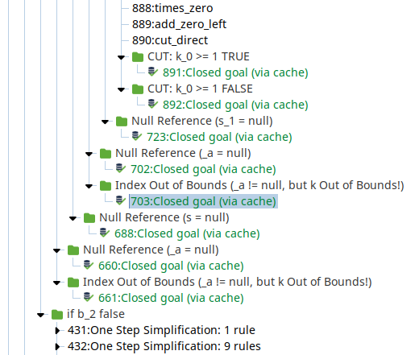

# Proof Caching

-- *Author: Arne Keller*, May 2023 valid for KeY-2.12.0

!!! abstract

    This note describes the new *Proof Caching* functionality in KeY 2.12.
    It allows reusing parts of earlier proofs when performing another proof.
   

## Overview

The *Proof Caching* functionality allows reusing previous proofs when creating a new proof.
More precisely, it allows you to close a branch of the proof by "reference" to an already closed branch in another proof.
This is only allowed if the branch in the new proof contains all of the formulas present in the old proof.
Additionally, the choice settings (handling of integer overflows etc.) of the two proofs have to be equal.

### Activating the extension

In KeY's settings dialog, enable the Proof Caching extension.
You can toggle the automatic search for references in the "Proof Caching" section (on by default).

### Automated reference search

When running the auto pilot or a strategy macro, KeY will automatically search for references
whenever the proof is branched.
This search considers all closed branches in other proofs and compares the current sequent to the
first node in the closed branch.

### Manual reference search

Right-click on an open goal in the proof tree and select "close by reference".
If a matching branch is found, the goal will be closed.
Otherwise, a dialog with an error message will open.

### Copying referenced proof steps

In the status line, a button indicates whether cached goals are present:

Clicking on the button opens a dialog with additional details where the referenced proof
may be copied into the new proof.

### Toolbar buttons

Two new buttons are added to the toolbar.

The first button copies all referenced steps into the current proof.
The second button jumps to the referenced proof step, if the currently selected node is a cached goal.

### Saving the full proof

When saving a proof that references other proofs, those proof steps are first copied into the new proof.
This ensures that the proof is reloadable and self-contained.
When a referenced proof is closed, the proof steps required in other proofs are first copied over.
