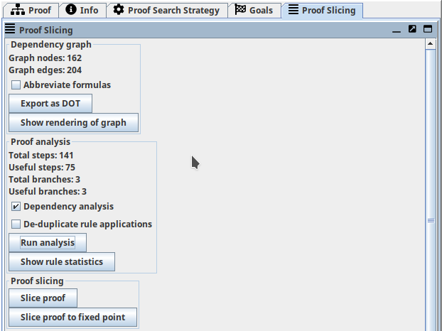
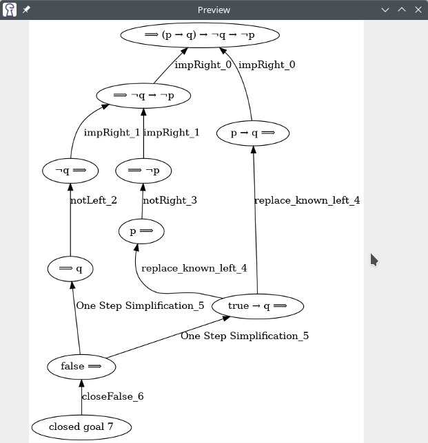
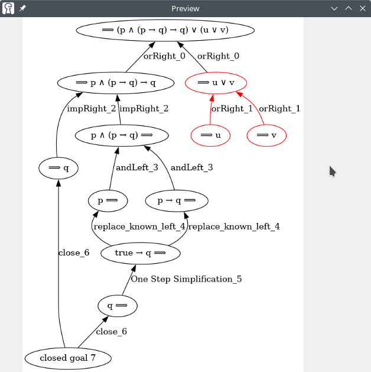
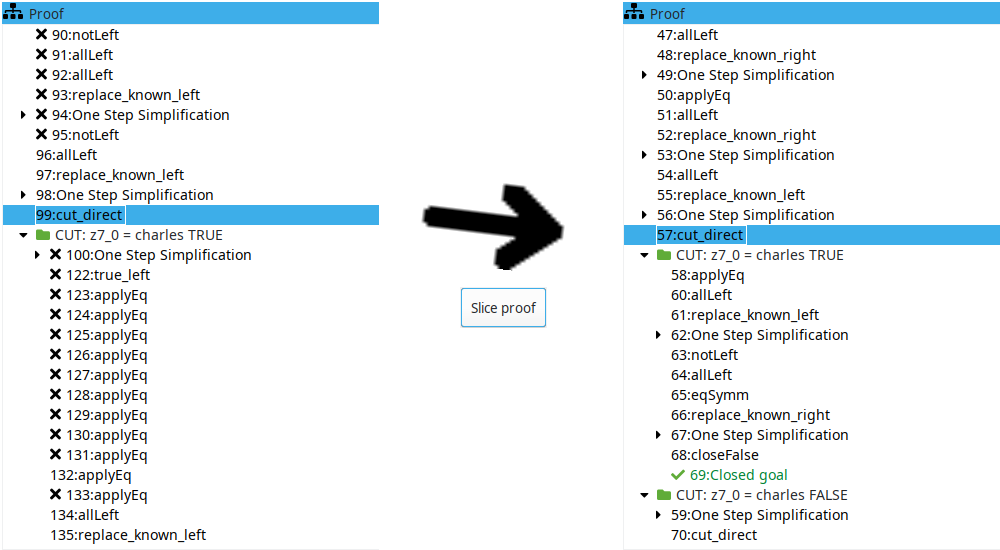

# Proof Slicing

-- *Author: Arne Keller*, December 2022 valid for KeY-2.12.0

!!! abstract

    This note describes the new *Proof Slicing* extension in KeY 2.12.
    It allows reducing the size of finished proofs by
    removing proof steps that are not necessary to close the proof.

    This feature is available if the extension is activated in the settings.
   

## Overview

The *Proof Slicing* extension aggregates several features:
automatic construction of the dependency graph (an alternative view on the proof),
two analysis algorithms to identify proof steps to remove,
and the proof slicing algorithm that constructs a new (smaller) proof slice given the analysis results.

## Dependency Graph

Each sequent formula in the proof is stored as a node in the dependency graph.
Proof steps are represented by a hyperedge starting at the new sequent formulas introduced.
If the step required some formulas to be present beforehand, the hyperedge points to these nodes.
(For technical reasons, this hyperedge is stored as a collection of regular edges from each input to each output.)
Proof steps that close a proof branch start at a special kind of node: a "closed goal" node.

The extension automatically constructs the dependency graph when loading or constructing a proof.
The number of nodes and edges is displayed in the sidebar.
You may inspect the dependency graph by clicking on "Show rendering of graph".
This requires an installation of [Graphviz](https://www.graphviz.org/) on your system (more specifically, `dot` or `dot.exe` needs to be in your `$PATH`).
Installation instructions are available [at graphviz.org](https://www.graphviz.org/download/).

You may also export the dependency graph in DOT format ("Export as DOT" button) and visualize it using any other tool of your choice.

<figure markdown>
  
  <figcaption>Dependency Graph of a simple proof (top node: proof obligation)</figcaption>
</figure>

!!! attention

    It is not advisable to render the dependency graph of large proofs: the render process may consume excessive amounts of memory and/or CPU time.

## Proof Analysis

The extension offers two analysis algorithms.
The first algorithm ("Dependency Analysis") uses the dependency graph to find proof steps that do not "contribute" to a closed goal.
If none of the sequent formulas introduced by a proof step are used in further steps to close a proof branch, the proof step
may be omitted.
The second algorithm ("De-duplicate rule applications") identifies identical proof steps in different proof branches which can be performed earlier in the proof.

After running the analysis algorithms, you may also inspect which proof steps will be removed.
They are marked with an 'X' in the proof tree panel (see last figure on this page).

!!! info

    Both algorithms may be combined.

<figure markdown>
  
  <figcaption>Dependency Graph: edges highlighted in red will be omitted in the proof slice</figcaption>
</figure>

## Proof Slicing

The last section of the sidebar allows you to slice the proof.
The "Slice proof" button runs the analysis algorithms (if not already done), constructs a proof slice, and loads the resulting proof.
It may be possible to slice the proof again to remove more proof steps.
The "Slice proof to fixed point" button repeatedly executes the analysis and slicing algorithms until no more size reductions are possible.

<figure markdown>
  
  <figcaption>Running the proof slicer creates a new proof</figcaption>
</figure>
